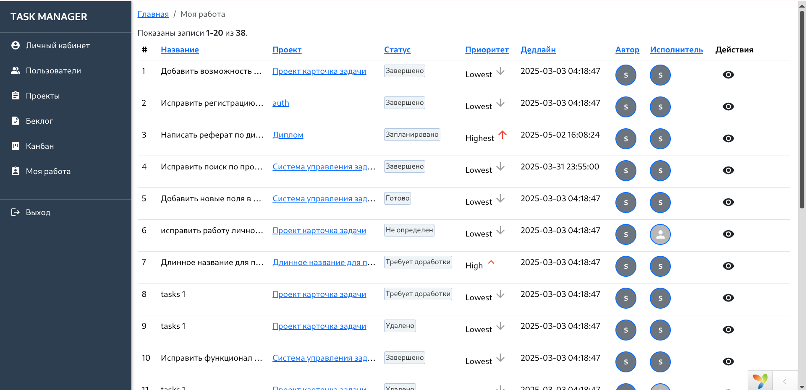
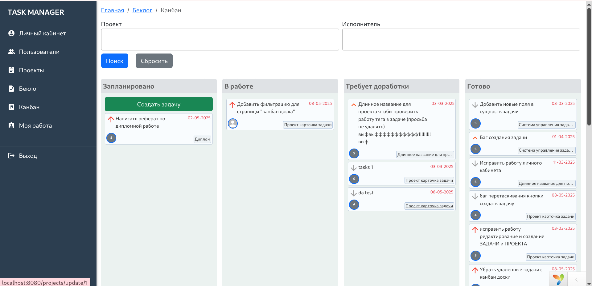

# Task Management System

## Описание

Информационная система для управления задачами в команде

## Запуск

`docker compose up -d --build`

`docker exec -it php bash`

`composer install`

`php yii migrate`

`php yii migrate --migrationPath=@yii/rbac/migrations`

`php yii my-rbac`

## Скриншоты

### Страница моя работа

### Редактирование задачи

### Канбан доска

### Беклог, задачи проекта

